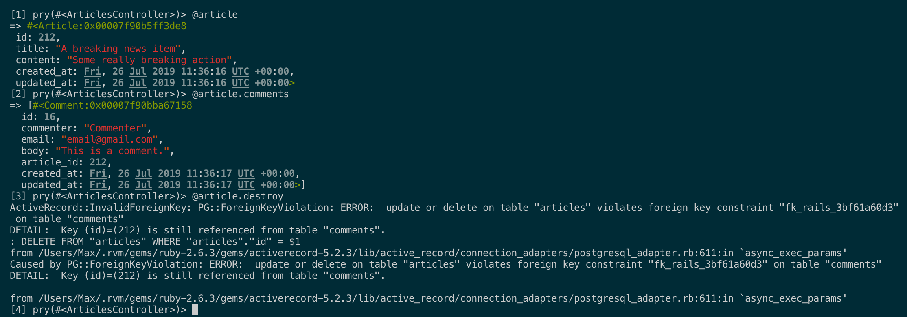
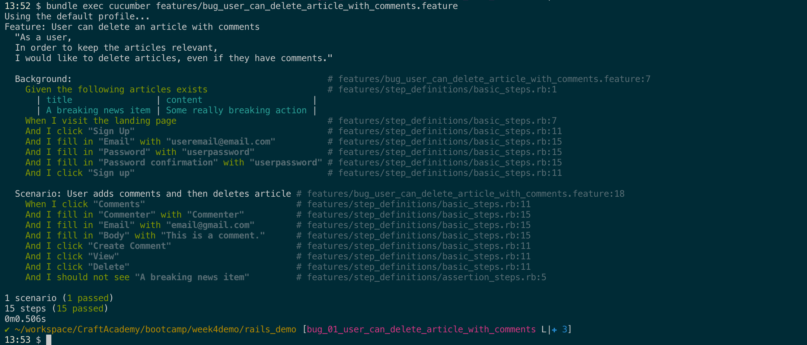

# Full Stack Application: Article publishing site 
Developed and documented by,
* Aubain, Max - [Github](https://github.com/CA-ma)

## Summary
**Front end**: HTML and CSS.<br>
**Display configuration**: Desktop only.<br>
**Back end**: Ruby on Rails.<br>
**Testing**: Cucumber feature test and Rspec unit test.

This repository contains a [Ruby on Rails](https://rubyonrails.org/) application that employs the creation, editing, deleting, and listing of articles in a blog-style format.  Users log in to view, post, and leave comments on articles with user authentication schemes provided by the [Devise](https://github.com/plataformatec/devise) gem. Feature tests drafted with Behavioral Driven Design (BDD) techniques drive the development process and unit tests are used to verify the functionality of the models.  Feature testing is accomplished with [Cucumber](https://cucumber.io/) and unit tests utilize [Rspec](https://rspec.info/).

Those of you familiar with Rails will probably recognize the general structure and format of this application from the [Getting Started with Rails](https://guides.rubyonrails.org/getting_started.html) guide.  Judging from the number of questions about this application on Stack Overflow, I would say it is one of the Rites of Passage for new Rails developers.  This is my **_go_** of it, with a heavy emphasis on acceptance testing, BDD, and applying each aspect of the Create, Read, Update, and Destroy (CRUD) data management flow in a single type of functionality: the posting of an article.  Included below is also a detailed account of one example of my trouble-shooting flow.

## Deployment and UI
[This application](https://rails-articles-demo.herokuapp.com/) is deployed using [Heroku hosting services](https://www.heroku.com/).  Heroku is suitable for hosting a Rails application as it includes a database with the site build.  The persistent storage of a database is required for the articles that are displayed on the page.

(Picture of app here)

## Building
To locally run or test this application, fork this repository to your github account and clone to a local workspace.  The following commands for Mac OS terminal, when run in your project directory, will configure your local workspace with the necessary gems and packages.

```
# INSTALLATION AND SETUP
# Install Ruby if it is not installed anywhere on your machine
$ brew install ruby

# Install Rails if it is not installed anywhere on your machine
$ gem install rails

# Install PostgreSQL if it is not installed anywhere on your machine
$ brew install postgres

# Install the gems listed in the Gemfile to your local workspace
$ bundle install

# Condition the database
$ rails db:setup

# COMMANDS
# Visit the site locally at 'localhost:3000' in a browser
$ rails s

# Run unit tests, feature tests, a specific feature test
$ bundle exec rspec
$ bundle exec cucumber
$ bundle exec cucumber features/name_of_feature_test_file.feature
```

Some of the gems in the [`Gemfile`](/Gemfile) chosen for this project are not standard with the default scaffolding of a Rails project.  These include,
* `gem 'cucumber-rails'`  =>  Feature testing with Cucumber
* `gem 'rspec-rails'`, `  gem 'factory_bot_rails'`, and `gem 'shoulda-matchers'`  =>  Unit testing with Rspec
* `gem 'devise'`  =>  User authentication with Devise
* `gem 'pry-byebug'`  =>  Debugging tool

## Development and Testing
Development is carried out using the BDD flow in a test driven framework.  For each feature added to the application, the feature is defined in a Cucumber feature file and the work is developed in a new respository branch.  If the feature is deemed functional and stable, it is merged with the master branch for 'production'.

**Development Log**
* Feature: [User can create article](./features/user_can_create_article.feature).
* Feature: [User can edit article](./features/user_can_edit_article.feature).
* Feature: [User can delete article](./features/user_can_delete_article.feature).
* Feature: [User can comment on article](./features/user_can_comment_on_article.feature).
* Feature: [User can edit article](./features/user_can_edit_article.feature).
* Feature: [User can login](./features/user_can_login.feature).
* Feature: [Add webpage style theme](./features/webpage_theme.feature).
* Bug: [User can delete article with comments](./features/bug_user_can_delete_article_with_comments.feature).
* Planned feature: Add additional features to webpage style theme.
* Planned feature: Add CSS media queries for mobile display.
* Planned feature: Add username to user model and display username as author of articles and comments.

## Testing Example: Bug Fix
A bug was discovered in the interaction between a series of sequentially added features that had successfully passed `Happy Path` tests, but in combination had created an untested scenario.  First, a feature to delete created articles was added.  Then, articles could be given comments, where Comment was an nested model within Article.  The bug revealed itself when a user was attempting to delete an article that had comments attached to it while the nested comments were not configured to be deleted with the article parent model.

The BDD methodology was followed for bug corretion.  A new [branch]() was created and a new [feature file](./features/bug_user_can_delete_article_with_comments.feature), was generated to show the bug in the user flow.

**Bug - Cannot delete articles with comments.**


Locate the method associated with the bug.

**Check method - Destroy method syntax.**


Before throwing code at the problem, it is useful to insert `binding.pry` near to where the error is triggered, as shown below.

**Check method - Add binding.pry debugger tool.**


`binding.pry` is a helper method from [Pry](https://github.com/pry/pry) that opens up the Pry terminal with the current state of the application during a feature test execution.

**Sanity check - Access state of application during test.**


The instance variables of interest can be investigated in the Pry terminal and the nature of the bug can be verified.

**Sanity check - Replicate bug.**


After searching on the web, often the fix can be found and added to the code base.  In this case, it is adding `dependent: :destroy` to the `has_many :comments` entity relationship between `articles` and `comments`.

**Bug Fix - Add new code.**


Rerunning the feature test for the bug confirms that the fix is valid.

**Bug Fix - Verify new code.**


## Acknowledgements
Thank you to [Craft Academy](https://craftacademy.se/) in Stockholm, Sweden for crafting this challenge.